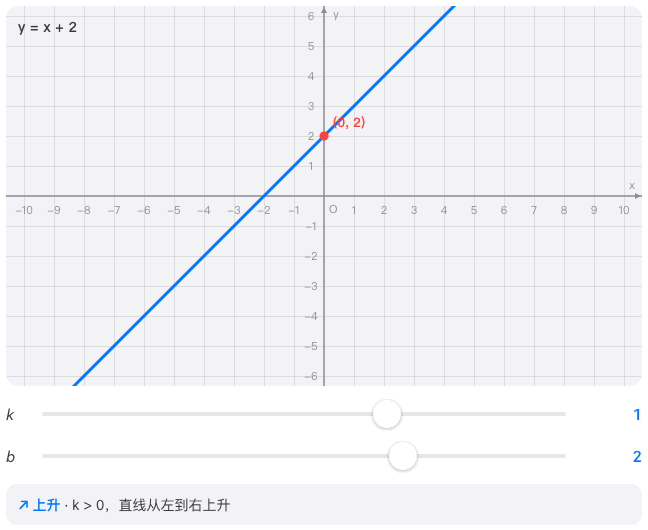

# 数形 shuxing

中文交互式数学可视化：从初中到数学前沿，成体系、系列化，开源。

灵感来自：3Blue1Brown 的系列化数学可视化。中文区没有原生头部的数学可视化工具——
这个仓库就是来填这个空位的。

## 愿景

把从初中到数学前沿的知识，做成成体系、系列化的中文交互式可视化。
不是零散的 demo，而是一部可以"追更"的可视化数学百科，开源给所有人。

**北极星**：老师/学生真实在用 + GitHub 开源影响力，两者都要。

## 演示

拖参数，看图像——30 秒看懂 k / b / a 是干嘛的。



## 当前进度：S1a 初中函数系列（v0.1 已发布）

- 一次函数 `y = kx + b`：拖 k/b 看直线变化
- 二次函数 `y = ax² + bx + c`：拖 a/b/c，看开口、顶点、对称轴
- 反比例函数 `y = k/x`：拖 k 看分支跳跃，k 的几何意义（矩形面积 = |k|）

## 快速开始

```bash
npm install
npm run dev        # 开发模式
npm run build      # 构建到 dist/
npm run preview    # 本地预览构建产物
```

## 路线图

| 系列 | 学段 | 状态 |
|---|---|---|
| S1a | 初中函数 | v0.1 已发布 |
| S1b | 初中几何 | 待启动 |
| S1c | 初中代数 | 待启动 |
| S1d | 初中统计概率 | 待启动 |
| S2 | 高中 | 待启动 |
| S3 | 大学 | 待启动 |
| S4 | 研究生/博士 | 待启动 |
| S5 | 数学前沿 | 待启动 |
| S6 | 小学 | 最后 |

详细规划见 [`docs/roadmap.md`](docs/roadmap.md)，
知识体系全图见 [`docs/knowledge-map.md`](docs/knowledge-map.md)。

## 项目宪法

[`docs/constitution.md`](docs/constitution.md) —— 所有决策的最高依据。
核心三条：**数学正确性是底线**；**用户体验最高优先级**（标杆：iOS 系统级交互）；
**诚实**（可视化不为好看牺牲准确）。

交互实现的唯一参考：[`prototype/ios-style-reference.html`](prototype/ios-style-reference.html)

## 内容生产与审核

每个知识点固定三段式：概念引入 → 交互探索 → 例题验证。
三层审核：L1 机器自检（数值正确性）→ L2 教研审核 → L3 真实用户抽检。
可视化适配度分级（★★★/★★☆/★☆☆）：宁可不上，不可硬上。

## License

[MIT](LICENSE)

> 演示 GIF 由 `node scripts/make-demo-gif.mjs` 生成（依赖 `playwright` 浏览器）。
